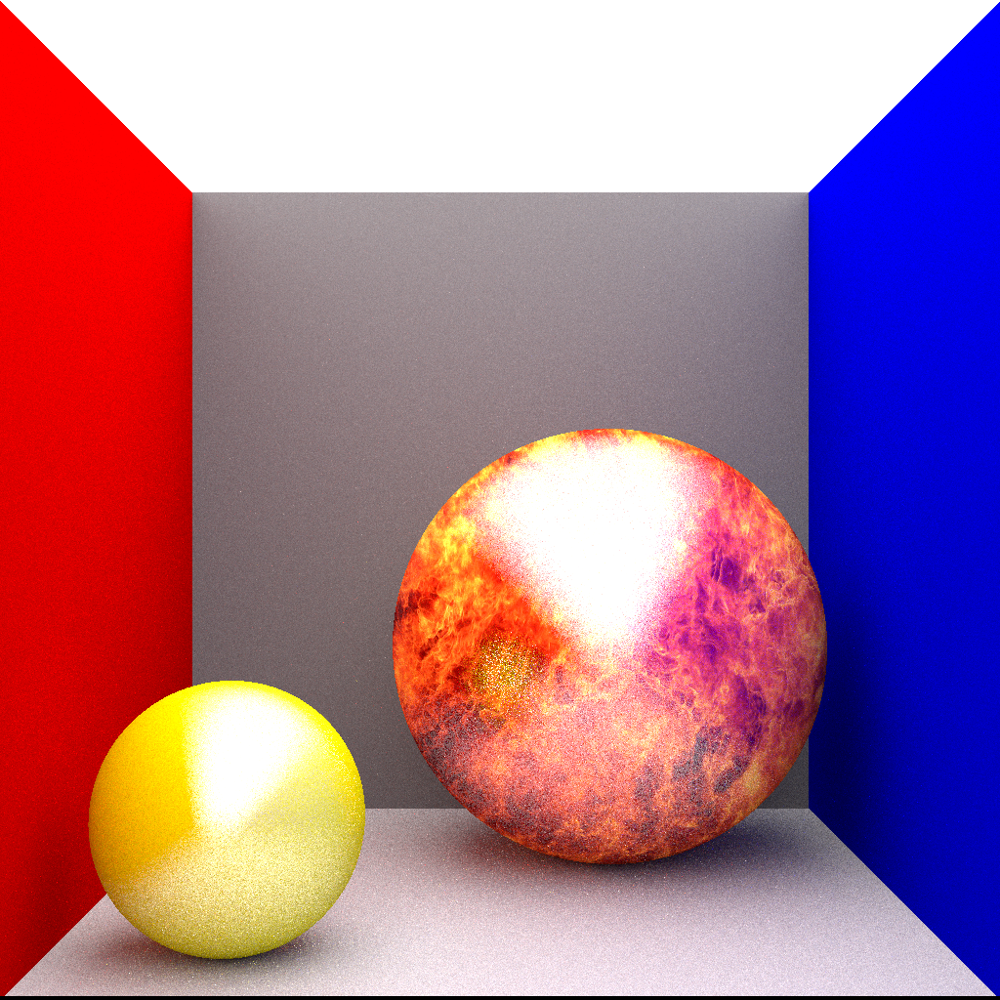

# A Path Tracer fully written in Java



This Path Tracer features:

 - Diffuse, Shiny and Textured Spheres
 - Global Illumination via Monte Carlo Integration 
 - Gaussian Multisampling

# How to use

Build the Path Tracer with gradle `graldew -jar`
Download a compatible Linux Version in the [Actions](https://github.com/cvoegele/PathTracer/actions) Tab of this project under Build Artefacts.

### Building your own scenes

```java 
 //create a scenerenderer object
 var sceneRenderer = new SceneRenderer(512, 512, numberOfThreads, sampleRate, bounces, true);
 //set the to be rendered scene
 sceneRenderer.setScene(setupCornellBox());
 //start render process
 sceneRenderer.renderScene();
 //the output will appear in the ./output directory as a .bmp file
```

```java
//example function to setup a scene. Here the classic Cornell Box with a texture on a sphere
private static Scene setupCornellBox() {
        //create a scene with an eye and lookAt Vector and FOV in degrees
        var scene = new Scene(new Vec3(0, 0, -4), new Vec3(0, 0, 6), 36);
        //add shiny spheres
        scene.addSphereShiny(new Vec3(-1001, 0, 0), 1000, new Vec3(0.3, 0, 0), Vec3.ONE);
        scene.addSphereShiny(new Vec3(1001, 0, 0), 1000, new Vec3(0, 0, 0.3), Vec3.ONE);
        scene.addSphereShiny(new Vec3(0, 0, 1001), 1000, new Vec3(0.1, 0.1, 0.1), Vec3.ONE);
        scene.addSphereShiny(new Vec3(0, 1001, 0), 1000, new Vec3(0.1, 0.1, 0.1), Vec3.ONE);
        //add emissive spheres
        scene.addSphereEmmissive(new Vec3(0, -1001, 0), 1000, new Vec3(0.8, 0.8, 0.8), Vec3.ONE.scale(4f));

        scene.addSphereShiny(new Vec3(-0.6, 0.7, -0.6), 0.3f, new Vec3(0.42, 0.42, 0), Vec3.ONE);
        try {
            //create a sphere with a texture
            var fireTexure = new SphereSphericalTextureMapping("earth.tif");
            scene.addSphereTextureShiny(new Vec3(0.3, 0.3, -0.3), 0.6f, fireTexure, Vec3.ONE);
        } catch (IOException e) {
            e.printStackTrace();
        }
        return scene;
    }

```

### Commandline Arguments

 
    ` -threads`     number of Threads the program should create to render the image
    ` -sampleRate`  the number of Rays that are being shot per pixel
     
All Arguments are optional. If left blank these Standard Values are taken:

    threads = 1
    sampleRate = 32 

Sample Arguments

`java -jar CornellBox.jar -threads='8' -sampleRate='128'`
